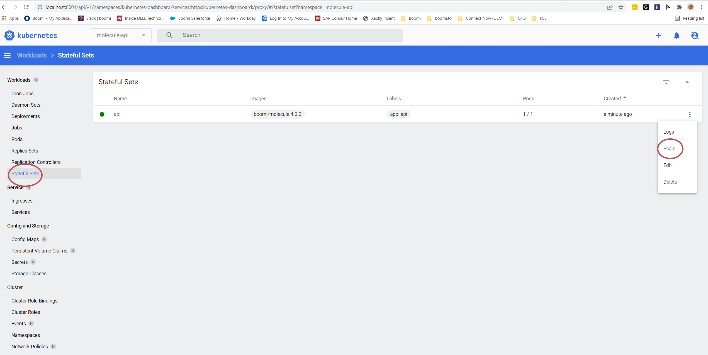

# Runtime Containers

This repository contains all Runtime containerization reference architectures, guidance, and definitions for configuring a Boomi Molecule on a Docker Desktop Kubernetes configuration.

## Reference Contents

[Kubernetes Reference Architecture - Boomi Molecule & Boomi Atom Cloud](https://bitbucket.org/officialboomi/runtime-containers/src/master/Kubernetes/)

[Setup of a Dell Boomi Molecule with multiple nodes on Kubernetes](https://github.com/anthonyrabiaza/BoomiKubernetes)

# Setup

**Be sure to be running as a local administrator!**

[Install Docker Desktop for Windows](https://hub.docker.com/editions/community/docker-ce-desktop-windows)

[Start Docker Desktop when you log in](https://docs.docker.com/desktop/windows/#general)

[Enable Kubernetes for Docker Desktop](https://docs.docker.com/desktop/kubernetes/)

[Install WSL](https://ubuntu.com/wsl)

# Start Kubernetes forwarding

Run the install script

```
./install.sh
```

Reload ~/.bashrc

```
source ~/.bashrc
```

To access the Kubernetes dashboard, start the proxy and navigate to the link below. 
The Boomi APIs should be accessible without port forwarding, but any modifications require this to be running.

```
kubectl proxy &
```

Run nginx and kubernetes-dashboard

```
kubectl apply -f tools/dashboard
```

```
kubectl apply -f tools/nginx
```

Navigate to [Kubernetes Dashboard](http://localhost:8001/api/v1/namespaces/kubernetes-dashboard/services/https:kubernetes-dashboard:/proxy/)

# Installer

```
Operation [ATOM | MOLECULE | ADDON]
--add Add
--name Name
--delete Delete
--path default /run/desktop/mnt/host/c/Boomi\ AtomSphere
--token Installer Token   
--port Port override for service. If ommitted, the service default port will be used
--node Externally accesible port for the service > must be between 30000 - 32767
--vm ATOM_VMOPTIONS_OVERRIDES - (Optional) A | (pipe) separated list of vm options to set on a new installation
--container CONTAINER_PROPERTIES_OVERRIDES - (Optional) A | (pipe) separated list of container properties to set on a new installation

boomi [ATOM | MOLECULE] --add --name NAME --token TOKEN [--path PATH] [--vm VM_OPTIONS --container CONTAINER_OPTIONS]
boomi [ATOM | MOLECULE] --delete --name NAME
boomi ADDON --add --name NAME [--port PORT] [--path PATH] [--node NODEPORT]
boomi ADDON --delete --name NAME
boomi ADDON --list
```

# Molecule

## Add

```
./boomi.sh MOLECULE --add --name NAME --token INSTALLER_TOKEN
```

**Wait until the Molecule is registered in Boomi before scaling out nodes!**



## Delete

```
./boomi.sh MOLECULE --delete --name NAME
```

## Example Options

```
--vm "-Xmx2048m" --container "com.boomi.container.sharedServer.http.maxConnectionThreadPoolSize=500|com.boomi.container.sharedServer.http.connector.authType=BASIC"
```

```
--vm $(cat kubernetes/molecule/atom-default.vmoptions | xargs | sed -e 's/ /|/g') --container $(cat kubernetes/molecule/container-default.properties | xargs | sed -e 's/ /|/g')
```

## Access API

In order to access the API, the Shared Web Server API Type needs to be set to [Advanced](https://community.boomi.com/s/article/Authentication-Available-to-the-Shared-Web-Server#Advanced-API-Type).

```
https://localhost/molecule/NAME
```

# Atom

## Add

```
./boomi.sh ATOM --add --name NAME --token INSTALLER_TOKEN
```

## Delete

```
./boomi.sh ATOM --delete --name NAME
```

## Example Options

```
--vm "-Xmx2048m" --container "com.boomi.container.sharedServer.http.maxConnectionThreadPoolSize=500|com.boomi.container.sharedServer.http.connector.authType=BASIC"
```

```
--vm $(cat kubernetes/atom/atom-default.vmoptions | xargs | sed -e 's/ /|/g') --container $(cat kubernetes/atom/container-default.properties | xargs | sed -e 's/ /|/g')
```

## Access API

In order to access the API, the Shared Web Server API Type needs to be set to [Advanced](https://community.boomi.com/s/article/Authentication-Available-to-the-Shared-Web-Server#Advanced-API-Type).

```
https://localhost/atom/NAME
```

# APIM

## Add

```
./boomi.sh APIM --add --name NAME --token INSTALLER_TOKEN
```

**Wait until the Gateway is registered in Boomi and developer portal loads before scaling out nodes!**


## Delete

```
./boomi.sh APIM --delete --name NAME
```

## Access API

In order to access the API, the Shared Web Server API Type needs to be set to Gateway on the migrated Boomi runtime.

The Public URL for the Location Settings and Developer Portal in APIM should be set to

```
https://localhost:443
```

The APIM Environment endpoints need to be prefixed with apim/{Environment Name}, where {Environment Name} is optional if your APIM will support multiple environments. for example

```
REST
apim/ws/rest

SOAP
apim/ws/soap

SOAP 1.2
apim/ws/soap12

OData
apim/ws/odata2
```

### Node Status

```
https://localhost/apim/node/_admin/status
```

### Developer Portal
```
https://localhost/
```

# Addons

Additional services can be installed to create integrations from and they can be accessed from within a Atom/Molecule from the internal DNS name or externally from the NodePort defined.

Sample datasets can be found under kubernetes/addons/SERVICE/datasets.

## Database Management

[SQL Server Management Studio](https://docs.microsoft.com/en-us/sql/ssms/download-sql-server-management-studio-ssms?view=sql-server-ver15)

[Oracle SQL Developer](https://www.oracle.com/tools/downloads/sqldev-downloads.html)

[MySQL Workbench](https://dev.mysql.com/downloads/workbench/)

## Boomi Connection Samples

[Boomi Kubernetes Demo](https://platform.boomi.com/AtomSphere.html#build;accountId=boomi_brianmerrick-4SYB9W;components=61eddde4-c766-4e0a-902d-f4a26cb47811;componentIdOnFocus=61eddde4-c766-4e0a-902d-f4a26cb47811)

Upload the assets under kubernetes/addons/NAME/jdbc to your account and deploy the following Boomi libraries to access the database connections.

```
Boomi_BrianMerrick/Processes/Boosters/Kubernetes Demo/mysql/JDBC mysql 8.0.27
Boomi_BrianMerrick/Processes/Boosters/Kubernetes Demo/mysql/JDBC mysql 8.0.27 v2
Boomi_BrianMerrick/Processes/Boosters/Kubernetes Demo/oracledb/JDBC Oracle Database 12.2.0.1
Boomi_BrianMerrick/Processes/Boosters/Kubernetes Demo/sqlserver/JDBC sqlserver 10.2.0 jre11
Boomi_BrianMerrick/Processes/Boosters/Kubernetes Demo/sqlserver/JDBC sqlserver 10.2.0 jre11 v2
```

## Hosts

```
Internal Host

SERVICE.NAMESPACE.svc.cluster.local:PORT

Example

openldap-1389.addons-openldap-1389.svc.cluster.local

External Host

127.0.0.1:NODEPORT

Example

127.0.0.1:30000
```

## List

```
./boomi.sh ADDON --list
```

## Add

### Connection Strings

```
SQL Server
  Server Name: 127.0.0.1,30030
  Authentication: SQL Server Authentication
    Login: sa
    Password: Password123!
    
mySQL
  Hostname: 127.0.0.1
  Port: 30000
  Username: root
  Password: password
  
OpenLDAP
  Hostname: 127.0.0.1
  Port: 30010
  User DN: cn=admin,dc=example,dc=org
  Password: password
  
Oracle
  Username: sys as sysdba
  Password: Password123!
  Hostname: 127.0.0.1
  Port: 30020
  SID: XE
  
SFTP
  Hostname: 127.0.0.1
  Port: 30040
  Username: user1
  Password: password1
  
MongoDB
  UI: https://localhost/addons/mongo
  Hostname: 127.0.0.1
  Port: 30050
  Username: root
  Password: password
  
Vault
  UI: https://localhost/ui
  Hostname: 127.0.0.1
  Port: 30070
  Token: OnIBNb78YqEXzEtbReUi3kDj
```

### Commands

```
./boomi.sh ADDON --add --name "mongodb"
./boomi.sh ADDON --add --name "openldap"
./boomi.sh ADDON --add --name "mysql"
./boomi.sh ADDON --add --name "oracledb"
./boomi.sh ADDON --add --name "sqlserver"
./boomi.sh ADDON --add --name "sftp"
./boomi.sh ADDON --add --name "vault"
```

### Bootstrap

Load sample data into all services. This process should be ran only once otherwise duplicate rows may appear and should be ran after verifying that all services are functional.

```
./bootstrap.sh
```

## Delete

```
./boomi.sh ADDON --delete --name "mongodb"
./boomi.sh ADDON --delete --name "openldap"
./boomi.sh ADDON --delete --name "mysql"
./boomi.sh ADDON --delete --name "oracledb"
./boomi.sh ADDON --delete --name "sqlserver"
./boomi.sh ADDON --delete --name "sftp"
./boomi.sh ADDON --delete --name "vault"
```

## Demos

### Cart

TBD