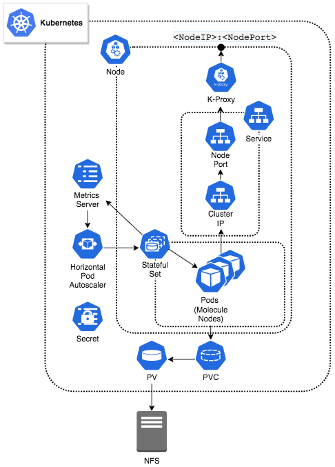

Contents:

* [Intent](#markdown-header-intent)
* [Architecture Overview](#markdown-header-architecture-overview)
* [Upgrading to Version 4 Images](#markdown-header-upgrading-to-version-4-images)
* [Requirements](#markdown-header-requirements)
* [Recommendations](#markdown-header-recommendations)
* [Configuration Review & Deployment](#markdown-header-configuration-review-deployment)
* [Recommended Deployment Additions - Autoscaling](#markdown-header-recommended-deployment-additions-autoscaling)
* [Deployment Complete](#markdown-header-deployment-complete)
* [Coordinating Notes](#markdown-header-coordinating-notes)
* [Supplemental Information](#markdown-header-supplemental-information)
--------------------------------------------------------------------------------------

# Kubernetes Reference Architecture - Boomi Molecule & Boomi Atom Cloud

## Intent
The following reference architecture outlines the requirements and limitations associated with running a Boomi Molecule or Boomi Atom Cloud in a Kubernetes-based environment.

Note that the Boomi Private Atom Cloud is similar in nature to the Boomi Molecule. This reference document can also be used to run a Cloud Molecule within a Boomi Private Atom Cloud with minor changes. These changes are detailed within this document.

Kubernetes (K8s) is a powerful and complex container orchestration platform with an ever-expanding ecosystem of services, support and tools.  The introduction and general education of Kubernetes in its many forms and possible configuration permutations are outside the scope of this document.  As such, **it is expected that the user has a working knowledge of Kubernetes concepts and components with an operational Kubernetes environment already deployed.**

Users can apply the Kubernetes technical foundation detailed in the following document to their own particular use cases and Kubernetes configurations.

--------------------------------------------------------------------------------------

## Architecture Overview
This reference architecture utilizes a containerized deployment in a localized Kubernetes environment to convey Boomi Molecule/Cloud Kubernetes configuration requirements and recommendations.  The example architecture deploys a Kubernetes containerized Molecule/Cloud cluster with elastic horizontal scaling and internal Kubernetes load balancer.



--------------------------------------------------------------------------------------
## Upgrading to Version 4 Images
In order to upgrade from the version 3 images to the version 4 images, the following changes to the Stateful Set
configuration are required:

* Privileged mode or a cgroups mount is no longer required. As such, we can remove `tmpfs` and `cgroup` volume
  mounts under `spec.template.spec.volumes` and `spec.template.spec.containers[0].volumeMounts`.

* A startup probe is no longer necessary, so `spec.template.spec.containers[0].startupProbe` can be removed.

* A new API has been provided for the readiness probe that checks if the Boomi Molecule/Cloud is ready for work 
  and can start accepting traffic. This enables us to replace `spec.template.spec.containers[0].readinessProbe` 
  with the following:
```yaml
readinessProbe:
  periodSeconds: 10
  initialDelaySeconds: 10
  httpGet:
    path: /_admin/readiness
    port: 9090
```

* A new API has also been provided for the liveness probe that checks if the Boomi Molecule/Cloud is running. 
  This enables us to replace `spec.template.spec.containers[0].livenessProbe` with the following:
```yaml
livenessProbe:
  periodSeconds: 60
  httpGet:
    path: /_admin/liveness
    port: 9090
```

* The environment variables `BOOMI_CONTAINERNAME` and `INSTALLATION_DIRECTORY` are no longer supported and can be 
  removed from `spec.template.spec.containers[0].env`.


While this section only covers the necessary changes to upgrade to the version 4 images, a detailed upgrade guide is
available in Dockerhub for [Boomi Molecule](https://hub.docker.com/r/boomi/molecule)
and [Boomi Atom Cloud](https://hub.docker.com/r/boomi/cloud).

--------------------------------------------------------------------------------------

## Known Limitations
**Atom Queues** are currently not supported by Boomi Molecule and Cloud clusters within elastic, scaled environments like Kubernetes. Specifically, scaling down using a deployed Atom Queue can result in data loss.

--------------------------------------------------------------------------------------

## Requirements
#### Kubernetes Version
The Boomi Molecule/Cloud Molecule and this reference architecture requires **Kubernetes version 1.16** or greater.

#### Kubernetes Configuration
The following Kubernetes configuration requirements are needed to successfully run a Boomi Elastic Molecule or Atom Cloud in a Kubernetes cluster. Further details about these configuration components are outlined under the [Configuration Review & Deployment](#markdown-header-configuration-review-deployment) section of this document. It is important for a user to familiarize themselves with the functionality of each requirement before proceeding.

* [Kubernetes Cluster](https://kubernetes.io/docs/concepts/overview/components/)
* [Node(s)](https://kubernetes.io/docs/concepts/architecture/nodes/)
* [Kubernetes Secrets](https://kubernetes.io/docs/concepts/configuration/secret/)
* [Kubernetes Service](https://kubernetes.io/docs/concepts/services-networking/service/)
* [Persistent Volume](https://kubernetes.io/docs/concepts/storage/persistent-volumes/)
* [Persistent Volume Claim](https://kubernetes.io/docs/concepts/storage/persistent-volumes/)
* [Stateful Set](https://kubernetes.io/docs/concepts/workloads/controllers/statefulset/)

#### Boomi Molecule/Cloud Configuration / Infrastructure
The following list outlines the general requirements that are needed to deploy a Boomi Molecule or Boomi Atom Cloud.

* Boomi account credentials.
* NFS solution provisioned and reachable by the Kubernetes environment.
  * The Boomi Molecule/Cloud requires the provisioning and availability of a Network File System (NFS).
* A Boomi Docker Image. This reference architecture currently supports:
  * Boomi Molecule Docker image ([publicly available](https://hub.docker.com/r/boomi/molecule)).
  * Boomi Atom Cloud Docker image ([publicly available](https://hub.docker.com/r/boomi/cloud)).

--------------------------------------------------------------------------------------

## Recommendations
Below are Kubernetes configuration recommendations for value added Kubernetes functions.

#### Kubernetes Configuration
**Autoscaling**  
The Boomi Molecule/Cloud shows its true power through its elastic capabilities. Although it is possible to deploy the Boomi Molecule/Cloud in a Kubernetes containerized environment without taking advantage of elasticity, it is highly recommended that users do so by deploying the following items:

* [Metrics Server](https://kubernetes.io/docs/tasks/debug-application-cluster/resource-metrics-pipeline/#metrics-server)
* [Horizontal Pod Autoscaler (HPA)](https://kubernetes.io/docs/tasks/run-application/horizontal-pod-autoscale/)

--------------------------------------------------------------------------------------
## Configuration Review & Deployment
The following configuration component files each represent a critical component in the example containerized stack, and are explained in depth later in this document. Note: You may rename these as appropriate if implementing a Boomi Atom Cloud.

* boomi_molecule_k8s_pv.yaml
* boomi_molecule_k8s_pvclaim.yaml
* boomi_molecule_k8s_secret.yaml
* boomi_molecule_k8s_service.yaml
* Boomi_molecule_k8s_statefulset.yaml
* k8s_metrics_server_install.sh
* boomi_molecule_k8s_hpa.yaml

These files correspond directly to an ordered deployment and are used within the following steps:

Required

1. Create the [Kubernetes Cluster and Node(s)](#markdown-header-kubernetes-cluster-nodes).
1. Create the required [NFS](#markdown-header-create-the-required-nfs-for-the-boomi-molecule) for the Boomi Molecule/Cloud.
1. Create [PersistentVolume](#markdown-header-create-persistentvolume).
1. Create [PersistentVolumeClaim](#markdown-header-create-persistentvolumeclaim).
1. Create Kubernetes [Secret](#markdown-header-create-kubernetes-secret).
1. Create [Service](#markdown-header-create-service).
1. Create [StatefulSet](#markdown-header-create-statefulset).

Recommended for utilizing autoscaling/elasticity capabilities:

1. Deploy the Kubernetes [Metrics Server](#markdown-header-deploy-the-kubernetes-metrics-server).
1. Deploy [Horizontal Pod Autoscaler (HPA)](#markdown-header-deploy-horizontal-pod-autoscaler-hpa).

--------------------------------------------------------------------------------------
#### Kubernetes Cluster & Node(s)
It is expected that the user has running a Kubernetes Cluster with all required Node(s) defined and deployed to the Cluster for their particular use case.  If multiple Nodes are deployed, this should include the necessary external load balancer solution (be it through a Cloud Service Provider (CSP) or hardware load balancer).  

As a baseline, this reference document utilizes a local Kubernetes environment ([Minikube](https://kubernetes.io/docs/tasks/tools/install-minikube/)) which represents the [lowest technical entry point](https://kubernetes.io/docs/tutorials/hello-minikube/) for a Kubernetes environment and provides all necessary functions to enumerate Boomi Molecule/Cloud Kubernetes configuration requirements and recommendations.

--------------------------------------------------------------------------------------
#### Create the required NFS for the Boomi Molecule/Cloud
The Boomi Molecule/Cloud requires the provisioning and availability of a **Network File System (NFS)**.  This requirement can be met through various options including a traditional NFS on an adjacent virtualized asset, NetApp or other PaaS offerings in a CSP.

In the deployment example, we will utilize an NFS hosted on an adjacent virtualized Linux asset.  Detailing the deployment of an NFS solution is out of scope for this document. More information regarding the Boomi Molecule/Cloud NFS requirement can be found [here](https://community.boomi.com/s/article/bestpracticesforruntimehighavailabilityanddisasterrecovery).

--------------------------------------------------------------------------------------
#### Create PersistentVolume
A [PersistentVolume (PV)](https://kubernetes.io/docs/concepts/storage/persistent-volumes/) is a piece of storage in the cluster. It is a resource in the cluster just like a node is a cluster resource. PVs have a lifecycle independent of any individual Pod that uses the PV.  The PV is bound to the external NFS created previously.  The PV is the first of two configuration components that will account for the Boomi Molecule/Cloud NFS requirement, taking the form of Persistent Storage in a Kubernetes deployment. The required PV is defined in the [boomi_molecule_k8s_pv.yaml](config/boomi_molecule_k8s_pv.yaml) configuration file:
```
apiVersion: v1
kind: PersistentVolume
metadata:
  name: nfs-pv
spec:
  capacity:
    storage: 5Gi
  volumeMode: Filesystem
  accessModes:
    - ReadWriteMany
  persistentVolumeReclaimPolicy: Retain
  nfs:
    server: <nfs_server_ip>
    path: </mnt/file_export>
```
* Configuration Note: The value for spec.capacity,storage should be configured for your specific storage requirements.

The PersistentVolume is deployed to the created Cluster using the following kubectl CLI command:
```
$ kubectl apply -f  boomi_molecule_k8s_pv.yaml
```
Expected return:
```
persistentvolume/nfs-pv created
```
--------------------------------------------------------------------------------------
#### Create PersistentVolumeClaim
A [PersistentVolumeClaim (PVC)](https://kubernetes.io/docs/concepts/storage/persistent-volumes/#persistentvolumeclaims) is a request for storage.  PVCs consume PV resources (like the one created in the previous step).  The PVC is the second configuration component that will account for the Boomi Molecule/Cloud NFS requirement.  The required PVC is defined in the [boomi_molecule_k8s_pvclaim.yaml](config/boomi_molecule_k8s_pvclaim.yaml) configuration file and is later referenced in the StatefulSet configuration.
```
apiVersion: v1
kind: PersistentVolumeClaim
metadata:
  name: nfs-claim
spec:
  accessModes:
    - ReadWriteMany
  storageClassName: “”
  resources:
    requests:
      storage: 5Gi
```
* Configuration Note: The value for spec.resources,requests.storage should be configured for your specific storage requirements.

The PersistentVolumeClaim is deployed to the Cluster using the following kubectl CLI command:
```
$ kubectl apply -f  boomi_molecule_k8s_pvclaim.yaml
```
Expected return:
```
persistentvolumeclaim/nfs-claim created
```
--------------------------------------------------------------------------------------
#### Create Kubernetes Secret
Kubernetes provides an object called [Secret](https://kubernetes.io/docs/concepts/configuration/secret/), which you can use to store sensitive data and provides more control over access and usage of passwords, keys, etc.

The Boomi Molecule/Cloud Docker image expects a number of environment variables passed during container creation.  Boomi Account_ID, Username and Password are expected variables that represent sensitive information.  The example deployment utilizes a Kubernetes Secret to provide access to sensitive information rather than putting it verbatim in a Pod definition.  The StatefulSet configuration references the Kubernetes Secret.  The Kubernetes Secret is defined in the [boomi_molecule_k8s_secret.yaml](config/boomi_molecule_k8s_secret.yaml).
```
apiVersion: v1
kind: Secret
metadata:
  name: boomi-secret
type: Opaque
stringData:
  username: **************************
  password: **************************
  account: *************************
```
**Note:**  YAML escape requirements for special characters must be observed in the ```stringData``` fields for ```stringData.password```, ```stringData.username``` and ```stringData.account```.  For example a password like:  
```
My"crazy',pa#$wo\rd"1!
```
would require the following escaping with encapsulated double quotation marks:
```
"My\"crazy',pa#$wo\\rd\"1!"
```

The Secret is deployed to the Cluster using the following kubectl CLI command:
```
$ kubectl apply -f  boomi_molecule_k8s_secret.yaml
```
Expected return:
```
secret/boomi-secret created
```

##### Alternative Configuration - Secret
The Boomi Molecule/Cloud also supports an [Installer Token](https://help.boomi.com/bundle/integration/page/r-atm-Installer_Token_object.html) object for installation instead of the above username and password credential method.


--------------------------------------------------------------------------------------
#### Create Service
A [Kubernetes Service](https://kubernetes.io/docs/concepts/services-networking/service/) is an abstract way to expose an application running on a set of Pods (Molecule/Cloud Nodes) as a network service.
The required Kubernetes Service is defined in the [boomi_molecule_k8s_service.yaml](config/boomi_molecule_k8s_service.yaml) configuration file.  
```
apiVersion: v1
kind: Service
metadata:
  name: molecule-service
  labels:
    app: molecule
spec:
  selector:
    app: molecule
  type: LoadBalancer
  ports:
  - protocol: TCP
    port: 80
    targetPort: 9090
```
Configuration elements of note:
```
Spec.type: LoadBalancer
```
* NodePort and ClusterIP Services are automatically created.


The Service is deployed to the created Cluster using the following kubectl CLI command:
```
$ kubectl apply -f  boomi_molecule_k8s_service.yaml
```
Expected return:
```
service/molecule-service created
```
```
$ kubectl get services
NAME                      TYPE           CLUSTER-IP     EXTERNAL-IP   PORT(S)       AGE
kubernetes             ClusterIP           10.96.0.1         <none>          443/TCP            8h
molecule-service   LoadBalancer   10.108.65.47   <pending>     80:31445/TCP   6s
```
```
$ lsof -i -nP | grep 31445
kube-prox 13784            root    8u  IPv4 515718      0t0  TCP *:31445 (LISTEN)
```


--------------------------------------------------------------------------------------
#### Create StatefulSet
In short, a [StatefulSet](https://kubernetes.io/docs/concepts/workloads/controllers/statefulset/) is:
>"A workload API object used to manage stateful applications, the deployment and scaling of a set of Pods, and provides guarantees about the ordering and uniqueness of these Pods."

The Boomi Molecule/Cloud requires the use of a StatefulSet to provide for the following:

* Stable, persistent storage.
* Ordered, graceful deployment and scaling.

The Stateful Set is defined in the [boomi_molecule_k8s_statefulset.yaml](config/boomi_molecule_k8s_statefulset.yaml).  This configuration file details a number of critical elements and ties together all previous configuration components into deployed Pods.
```
apiVersion: apps/v1
kind: StatefulSet
metadata:
  name: molecule
  labels:
    app: molecule
spec:
  selector:
    matchLabels:
      app: molecule
  serviceName: "molecule-service"
  replicas: 3
  template:
    metadata:
      labels:
        app: molecule
    spec:
      terminationGracePeriodSeconds: 60
      volumes:
        - name: molecule-storage
          persistentVolumeClaim:
            claimName: nfs-claim
      securityContext:
        fsGroup: 1000
      containers:
      - image: boomi/molecule:techpreview # Change image to boomi/cloud:techpreview for Boomi Cloud      
        imagePullPolicy: Always
        name: atom-node
        ports:
        - containerPort: 9090
          protocol: TCP
        lifecycle:
          preStop:
            exec:
              command:
                - sh
                - /home/boomi/scaledown.sh
        resources:
          limits:
            cpu: "1000m"
            memory: "1024Mi"
          requests:
            cpu: "500m"
            memory: "768Mi"
        volumeMounts:
          - name: molecule-storage
            mountPath: "/mnt/boomi"
        readinessProbe:
          periodSeconds: 10
          initialDelaySeconds: 10
          httpGet:
            path: /_admin/readiness
            port: 9090
        livenessProbe:
          periodSeconds: 60
          httpGet:
            path: /_admin/liveness
            port: 9090
        env:
        - name: BOOMI_ATOMNAME
          value: "boomi-molecule-k8"
        - name: ATOM_LOCALHOSTID
          valueFrom:
            fieldRef:
              fieldPath: metadata.name
        - name: BOOMI_ACCOUNTID
          valueFrom:
            secretKeyRef:
              name: boomi-secret
              key: account
        - name: BOOMI_USERNAME
          valueFrom:
            secretKeyRef:
              name: boomi-secret
              key: username
        - name: BOOMI_PASSWORD
          valueFrom:
            secretKeyRef:
              name: boomi-secret
              key: password
        - name: ATOM_VMOPTIONS_OVERRIDES
          value:
        - name: CONTAINER_PROPERTIES_OVERRIDES
          value:

```


Configuration elements of note:
```
spec.serviceName: "molecule-service"
```
* Links Stateful Set to previously deployed Service.


```
spec.template.spec.terminationGracePeriodSeconds: 60
```
* Duration in seconds the pod needs to terminate gracefully after the PreStop hook is called.  This number should be greater than the Molecule setting for com.boomi.container.elasticity.forceRestartOverride.  More information on the setting can be found [here](https://help.boomi.com/bundle/integration/page/r-atm-Properties_panel_Advanced_tab.html).

```
spec.template.spec.volumes.persistentVolumeClaim.claimName: nfs-claim
spec.template.spec.volumesMounts.name: molecule-storage
```
* References the previously deployed Persistent Volume Claim which in turn references the Persistent Volume bound to the deployed NFS culminating in a mount point in the deployed Pods.


* For a molecule:
    ```
    spec.template.spec.containers.image: boomi/molecule:techpreview
    ```
* For a cloud:
    ```
    spec.template.spec.containers.image: boomi/cloud:techpreview
    ```

* Pulls Boomi Molecule/Cloud release docker image directly from Docker Hub.


```
spec.template.spec.containers.resources.limits.cpu: “1000m”
spec.template.spec.containers.resources.limits.memory: “1024Mi”
spec.template.spec.containers.resources.requests.cpu: “500m”
spec.template.spec.containers.resources.requests.memory: "768Mi"
```
* Pod resource allocations used in scheduling and Horizontal Pod Autoscaling through the Metrics Server.  The memory request value should be at least 20% above the heap size with a limit size 25% over the request value to avoid OOM kills.  The default heap size is set at 512MB.  The heap size can be overridden using the vm options override environment variable.


```
spec.template.spec.containers.readinessProbe:
spec.template.spec.containers.livenessProbe:
```
* Provides health checks for initial and continued Molecule/Cloud pod status.


```
spec.template.spec.containers.env.name: BOOMI_ACCOUNTID
spec.template.spec.containers.env.name: BOOMI_USERNAME
spec.template.spec.containers.env.name: BOOMI_PASSWORD
```
* Sensitive information environment variables derived from previously deployed Kubernetes Secret.

```
spec.template.spec.containers.env.name: ATOM_VMOPTIONS_OVERRIDES
spec.template.spec.containers.env.name: CONTAINER_PROPERTIES_OVERRIDES
```
* A | (pipe) separated list of vm options and container properties to set on a new installation.  More information can be found in the image Overview on Docker Hub [here](https://hub.docker.com/r/boomi/molecule).

The Stateful Set is deployed to the Cluster using the following kubectl CLI command:
```
$ kubectl apply -f  boomi_molecule_k8s_statefulset.yaml
```
Expected return:
```
statefulset.apps/molecule created
```


--------------------------------------------------------------------------------------

## Recommended Deployment Additions - Autoscaling

#### Deploy the Kubernetes Metrics Server
The [Metrics Server](https://kubernetes.io/docs/tasks/debug-application-cluster/resource-metrics-pipeline/#metrics-server) is a scalable, efficient source of container resource metrics for Kubernetes built-in autoscaling pipelines.  The Metrics Server collects resource metrics from Kubelets and exposes them in Kubernetes apiserver through a Metrics API for use by Horizontal Pod Autoscaler (HPA).  

The Metrics Server is a required component to deploy the HPA addressed later in this document.  The [k8s_metric_server_install.sh](config/k8s_metrics_server_install.sh) file is a simple bash script that automates the download and deployment of the most current version of the Metrics Server.

Instructions on how to manually download and deploy the metric server can be found [here](https://github.com/kubernetes-sigs/metrics-server#deployment).

Expected return:
```
clusterrole.rbac.authorization.k8s.io/system:aggregated-metrics-reader created
clusterrolebinding.rbac.authorization.k8s.io/metrics-server:system:auth-delegator created
rolebinding.rbac.authorization.k8s.io/metrics-server-auth-reader created
apiservice.apiregistration.k8s.io/v1beta1.metrics.k8s.io created
serviceaccount/metrics-server created
deployment.apps/metrics-server created
service/metrics-server created
clusterrole.rbac.authorization.k8s.io/system:metrics-server created
clusterrolebinding.rbac.authorization.k8s.io/system:metrics-server created
```


--------------------------------------------------------------------------------------
#### Deploy Horizontal Pod Autoscaler (HPA)
The Horizontal Pod Autoscaler (HPA) automatically scales the number of pods in a replication controller, deployment, replica set or stateful set based on observed CPU utilization and or memory utilization.   As load inside the Boomi Molecule/Cloud increases, Molecule/Cloud nodes (Kubernetes pods) are added to the Kubernetes Cluster dynamically to provide capacity.  As load subsides, Molecule/Cloud nodes (Kubernetes pods) are removed to reclaim resources.  

The HPA is described in the [boomi_molecule_k8s_hpa.yaml](config/boomi_molecule_k8s_hpa.yaml) configuration file.  The HPA is the initial catalyst for all autoscaling events inside the Cluster.
```
apiVersion: autoscaling/v2beta2
kind: HorizontalPodAutoscaler
metadata:
  name: molecule-hpa
  labels:
    app: molecule
spec:
  scaleTargetRef:
    apiVersion: apps/v1beta1
    kind: StatefulSet
    name: molecule
  minReplicas: 3
  maxReplicas: 20
  behavior:
    scaleDown:
      stabilizationWindowSeconds: 60
  metrics:
  - type: Resource
    resource:
      name: cpu
      target:
        type: Utilization
        averageUtilization: 50
  - type: Resource
    resource:
      name: memory
      target:
        type: Utilization
        averageUtilization: 50
```


Configuration elements of note:
```
spec.minReplicas: 3
spec.maxReplicas: 20
```
* Minimum and maximum numbers of Pods maintained by the HPA.
* A minimum of 3 replicas is recommended.

```
spec.behavior.scaleDown.stabilizationWindowSeconds: 60
```
* Look back window for computed desired states when testing for a scaledown event.


```
spec.metrics
```
* Specifies which resource(s) to use when calculating the desired replica count (the maximum replica count across all metrics will be used).


The HPA is deployed to the Cluster using the following kubectl CLI command:
```
$kubectl apply -f boomi_molecule_k8s_hpa.yaml --validate=false
```
Expected return:
```
horizontalpodautoscaler.autoscaling/molecule-hpa created
```

--------------------------------------------------------------------------------------
## Deployment Complete
At this point, all defined Cluster components have been deployed.  Navigating to the Boomi AtomSphere Portal, we should see our Molecule/Cloud reflected in the Atom Management section and waiting to be assigned to a given environment with subsequent process download for execution.  As load inside the Boomi Molecule/Cloud increases, Molecule/Cloud nodes (Kubernetes pods) are added to the Kubernetes Cluster dynamically to provide capacity.  As load subsides, Molecule/Cloud nodes (Kubernetes pods) are removed to reclaim resources.

--------------------------------------------------------------------------------------
## Coordinating Notes
#####
By default, the Molecule and Cloud Docker images configure local storage as documented [here](https://help.boomi.com/bundle/integration/page/t-atm-Enabling_local_storage_for_a_Molecule_or_Atom_Cloud.html). You may experience performance benefits from mounting this to a local SSD drive rather than the POD's file system.

##### Useful kubectl CLI Commands
Below are some helpful kubectl and CLI commands to see pod metrics, pod autoscaling actions and node metrics.

HPA state:
```
$kubectl get hpa -w
```
Pod status/scaling:
```
$kubectl get pods -w -l app=molecule
```
Pod resource usage watch:
```
kubectl top pods
```
Cluster Node resource usage:
```
$watch kubectl top nodes
```

## Supplemental Information
[Kubernetes Reference Architecture - Supplemental Information and FAQs](https://community.boomi.com/s/article/Kubernetes-Reference-Architecture-Supplemental-Information-and-FAQs)